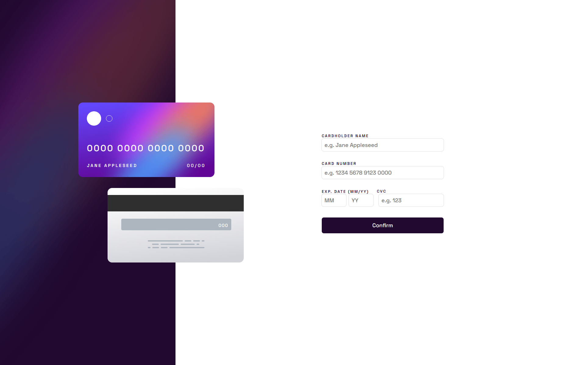

# Frontend Mentor - Interactive card details form solution

(Project #4)
This is a solution to the [Interactive card details form challenge on Frontend Mentor](https://www.frontendmentor.io/challenges/interactive-card-details-form-XpS8cKZDWw).

## Table of contents

- [Overview](#overview)
  - [The challenge](#the-challenge)
  - [Screenshot](#screenshot)
  - [Links](#links)
- [My process](#my-process)
  - [Built with](#built-with)
  - [Continued development](#continued-development)
- [Author](#author)

## Overview

### The challenge

Users should be able to:

- Fill in the form and see the card details update in real-time ✔️
- Receive error messages when the form is submitted if:
  - Any input field is empty ✔️
  - The card number, expiry date, or CVC fields are in the wrong format ✔️
- View the optimal layout depending on their device's screen size ✔️
- See hover, active, and focus states for interactive elements on the page ✔️

### Screenshot

### Links

- Solution URL: [Add solution URL here](https://your-solution-url.com)
- Live Site URL: [Add live site URL here](https://your-live-site-url.com)

## My process

### Built with

- Less
- CSS custom properties
- Flexbox
- Responsive design
- BEM methodology

### Continued development

In the future projects I'd like to focus on something with more interactability, animations and work on my canvas skills as well as reduce the length of my style sheets and improve overall javascript logic.

## Author

- LinkedIn - [Tim Klančišar](https://www.linkedin.com/in/tim-klan%C4%8Di%C5%A1ar-91a359225/)
- Frontend Mentor - [@TimKlancisar](https://www.frontendmentor.io/profile/TimKlancisar)
